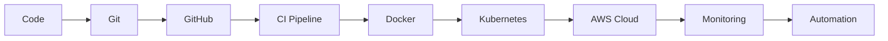

<div align="center">


<br>

<p>

<a href="https://github.com/Harshal0215">

</a>

<a href="https://www.linkedin.com/in/harshal-masram-1875a31a3">

</a>

<a href="https://YOUR-NETLIFY.netlify.app">

</a>


</p>

</div>

---

#  Hey, I'm Harshal Masram

```yaml
Alias      : HarshByte
Role       : Self-Driven Cloud & DevOps Enthusiast
Focus      : Cloud Architecture • Automation • Infrastructure as Code
Location   : India 🇮🇳
Philosophy : "Automate everything that deserves to exist twice."
```

> *"Infrastructure should be invisible, scalable, and automated."*

---

#  About Me

```text
> whoami

I'm a passionate Cloud & DevOps enthusiast who enjoys designing,
building, and automating infrastructure that is scalable, reliable,
and production-ready.

My interests revolve around:

☁️ Cloud Computing
🐳 Containerization
⚙️ DevOps Automation
🚀 CI/CD Pipelines
🏗 Infrastructure as Code
🔐 Cloud Security
📈 Monitoring & Observability

I enjoy solving infrastructure challenges more than UI bugs ☕
```

---

# ⚡ Tech Arsenal

## ☁️ Cloud Platforms

<p>


</p>

---

## 🚀 DevOps

<p>


</p>

---

## 💻 Development

<p>


</p>

---

# 📊 GitHub Analytics

<div align="center">


</div>

---

<div align="center">


</div>

---

# 🏆 GitHub Achievements

<div align="center">


</div>

---

# 📈 Contribution Graph

<div align="center">


</div>

---

# 🚀 Featured Projects

## 🔥 CI/CD Pipeline for a Dockerized Two-Tier Web Application

```text
Stack
─────
🐳 Docker
📦 Docker Compose
⚙️ Jenkins
🌿 Git

✔ Automated build
✔ Continuous Integration
✔ Continuous Deployment
✔ Containerized Architecture
✔ Version Controlled
```

---

## ☁️ Serverless Static Website Hosting on AWS using Terraform

```text
Stack
─────
☁ AWS S3
🌍 CloudFront
🔐 IAM
🏗 Terraform

✔ Infrastructure as Code
✔ Global Content Delivery
✔ Automated Deployment
✔ Secure Permissions
```

---

# 🌱 Currently Learning

```text
📚 Kubernetes Advanced Networking

📚 GitHub Actions

📚 Helm

📚 ArgoCD

📚 Prometheus

📚 Grafana

📚 AWS ECS

📚 Platform Engineering

📚 Cloud Security

📚 Linux Internals
```

---

# 💭 Dev Philosophy

> **"First make it work. Then make it reliable. Then automate it."**

<br>

> **"If it's manual twice, automate it."**

<br>

> **"The best servers are the ones you never have to SSH into."**

---

# ⚡ Current Mission

```diff
+ Designing scalable cloud infrastructure

+ Building production-ready CI/CD pipelines

+ Learning advanced Kubernetes concepts

+ Exploring Platform Engineering

+ Contributing to Open Source

+ Becoming a Cloud Architect
```

---

# 🌐 Connect With Me

<div align="center">

<a href="https://www.linkedin.com/in/harshal-masram-1875a31a3">

</a>

<a href="https://YOUR-NETLIFY.netlify.app">

</a>

<a href="mailto:your@email.com">

</a>

</div>

---

# 💡 Random Dev Quote

<div align="center">


</div>

---

# 🐍 Contribution Snake

> **Enable the GitHub Action after creating your profile repository.**

<div align="center">


</div>

---

# ⚙️ My Workflow



---

# 📌 Motto

<div align="center">

### ☁️ Build • Automate • Deploy • Repeat

*"Great infrastructure isn't noticed when it's working. That's the point."*

</div>

---

<div align="center">


### ⭐ Thanks for stopping by!

**If you like what I build, consider following me and checking out my repositories.**


</div>
